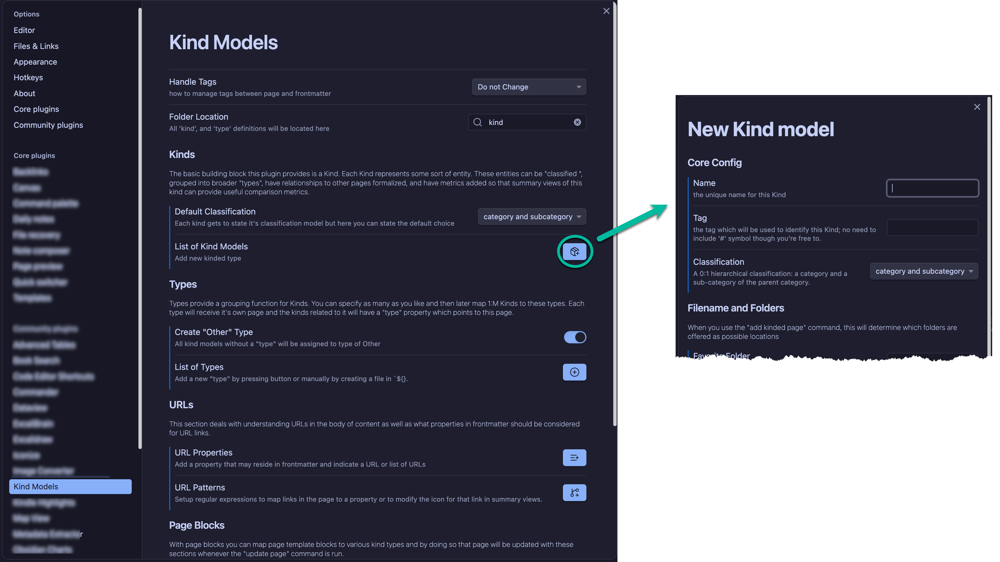

# Kind Model Plugin

> `obsidian-kind-model`

## Overview

This repo is a plugin for the popular [Obsidian](https://obsidian.md) editor and extends it's functionality to produce "kinded models" of entities you want to represent in your PKM.

The **kind** definitions are nothing more than markdown files in your vault which conform to a particular naming convention for Frontmatter properties. Knowing this convention is actually unimportant to start as you can design your ken entities using the configuration tab in Obsidian:

### What's so good about a Kind?

Ok so I can define a **kind**. Why should I care? What does it do? Before we lose you -- _ye of little faith_ -- let's cover a couple of the top benefits:

- **Classification**

  You can classify any _kinded_ page with a few different classification schemes. The default scheme is **category/subcategory** which allows you to associate each kinded page with a "category" and a more specific "sub-category" (should you want).

  A _kinded_ entity doesn't need to classify itself but by doing so it creates a link to a page which then shows the aggregation of all pages which share this classification. This _abstracted_ relationship is often more powerful than just a direct relationship as it not only helps contextualize in it's own right it provides an easily navigable solution for discovery (aka, what things are related to my current thing).

  Ideas are sometimes hard to follow without concrete examples, so let's imagine we've defined a **kind** called `Software Product` and that we have two pages which _implement_ this kind:

  - Adobe Lightroom
    - category: "[[Audio Visual]]",
    - sub_category: "[[Photo Mgmt]]"
  - Apple's Final Cut
    - category: "[[Audio Visual]]",
    - sub_category: "[[Video Production]]"

  Now since both products have been given the same category, you can click through to the _category page_ and it will automatically (via a dataview query) show both products. This means you can focus on the individual items but also get the _aggregation_ for free. The same applies to the sub-category too but in our example here, they vary and so what you'd see is a more fine grained aggregation of the software that matches both the category and subcategory.

- **Direct Relationships**

  While classification provides a nice way to contextualize a _kinded page_ and identify peers of that entity, it's often important to draw out direct relationships between one entity and another. Importantly, a direct relationship can be between two pages of _the same kind_ but often it is a means to map one kind of page to another.

- **Metrics**

  Metrics are data points which we capture in life. They are always _numeric_ and they always relate to some sort of _unit of measure_(UOM). With this plugin, you can express which metrics a particular kind can capture and what UOM should be assumed. What's nice about this is that not only are authors of a given page able to be reminded of the precise metrics that are available to the page but when you are looking at a query across an aggregation of this kind you can see the same metrics reported back to you.

All three of these are covered in greater detail in the sections below.

## Classification

TBD

## Direct Relationships

TBD

## Metrics

TBD

## Other Features

TBD
